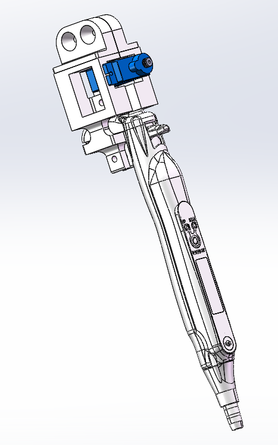

# auto_pipetty
This pkg provides a customized version of pipetty which is enabled to push the tip disposal button by a motor

## pipetty
"Pipetty" is an electronic pipette of Icomes Lab Co., Ltd., [https://www.icomes.co.jp/product/pipetty/](https://www.icomes.co.jp/product/pipetty/).  
The function of liquid handling (aspiration, dispensing) can be controlled through the USB or Bluetooth.

## Setup 
```
sudo chmod 666 /dev/ttyACM0
sudo usermod -a -G dialout $USER
```

## Usage
```
roslaunch auto_pipetty auto_pipetty.launch
```

## Hardware of auto_pipetty
- Parts CAD files are available here
  - [Google drive](https://drive.google.com/drive/folders/1CdFMPOSmqitSQ_oM1WGsw9cjXzKC6Rv5?usp=drive_link)
- The motor with the gear and gear rack: [KITRONIK-2595](https://kitronik.co.uk/products/2595-linear-actuator).
  - It is avairable from [switch-science](https://www.switch-science.com/products/8609?variant=42505484828870)

assembly image   
 

